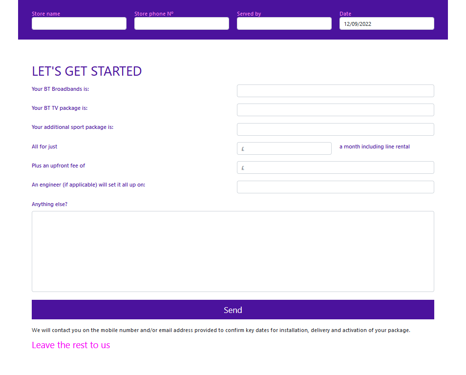
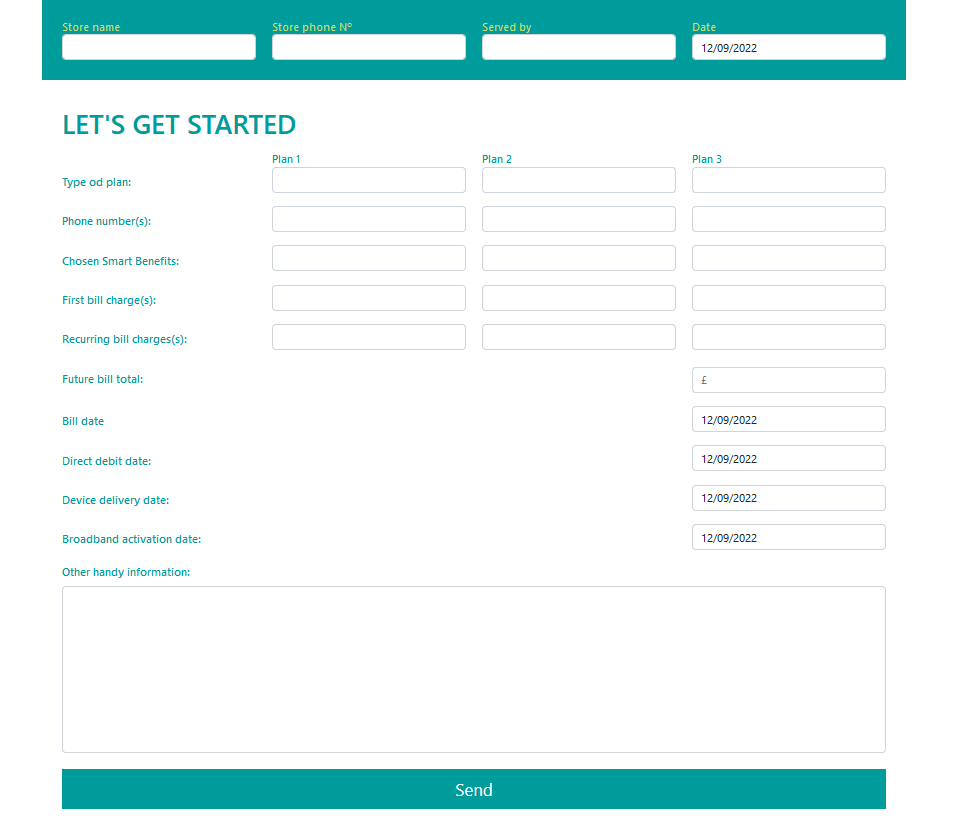

# React Double Form

React double form for desktop and tablet users.

## Browser Compatibility

All of the latest versions of <b>Chrome</b>, <b>Firefox</b>, <b>Edge</b> and <b>Opera</b> browsers are supported.

## Installation

#### Steps to install

<ol>
  <li>download the folder/git clone the repo</li>
  <li>cd root directory of the folder</li>
  <li>npm install</li>
  <li>npm start</li>
  <li>access localhost:3000 on your browser</li>
</ol>

## Screenshots

BT Form

EE-form

[Back to the top](#react-double-form)
